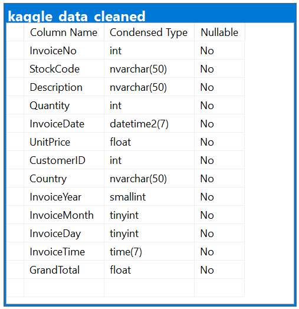

# Kaggle E-Commerce Project

## Project Overview

Analysing e-commerce transactional data to:

- Insights into sales trends based on time
- Understand customer behaviour
- Build a product recomendation System
- Creating an interactive dashboard for stakeholders

## Data Source

This is a transnational dataset from Kaggle which contains all the transactions occurring between 01/12/2010 and 09/12/2011 for a UK-based and registered non-store online retail. The company mainly sells unique all-occasion gifts. Many customers of the company are wholesalers.

## Data Structure

| InvoiceNo | StockCode | Description                        | Quantity | InvoiceDate         | UnitPrice | CustomerID | Country        | InvoiceYear | InvoiceMonth | InvoiceDay | InvoiceTime | GrandTotal |
| --------- | --------- | ---------------------------------- | -------- | ------------------- | --------- | ---------- | -------------- | ----------- | ------------ | ---------- | ----------- | ---------- |
| 536365    | 85123A    | WHITE HANGING HEART T-LIGHT HOLDER | 6        | 2010-12-01 08:26:00 | 2.55      | 17850      | United Kingdom | 2010        | 12           | 1          | 08:26:00    | 15.30      |
| 536365    | 71053     | WHITE METAL LANTERN                | 6        | 2010-12-01 08:26:00 | 3.39      | 17850      | United Kingdom | 2010        | 12           | 1          | 08:26:00    | 20.34      |

## Insights Summary

### Monthly Sales Trends:

- What is the overall trend in monthly sales (e.g., growing, declining, stable)?
- Are there any significant seasonal peaks or troughs in sales (e.g., higher sales around holidays, lower sales in certain months)?
- How does sales performance compare year-over-year for the same months?
- Which month recorded the highest sales, and which had the lowest?

---

### Daily Sales Trends:

- Are there specific days within a month that consistently show higher or lower sales?
- Do sales fluctuate significantly from day to day, or are they relatively consistent?
- Are there any unusual spikes or dips that might correspond to specific events (e.g., promotions, news, external factors)?

---

### Hourly Sales Trends:

- What are the peak hours for sales activity during a typical day?
- Are there significant periods of inactivity or very low sales?
- Does the hourly pattern vary by day of the week or by month? (This would be a more advanced analysis).
- At what time do most customers make their purchases?

## Recommendations

## Dashboard
