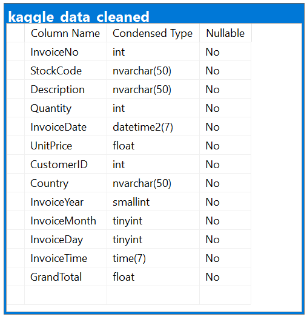
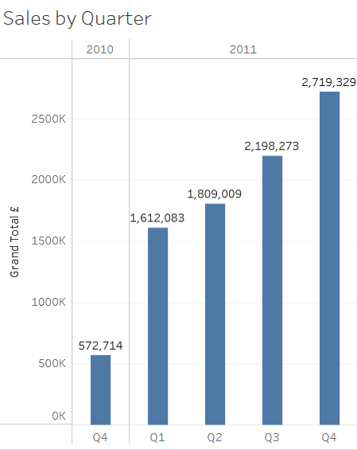
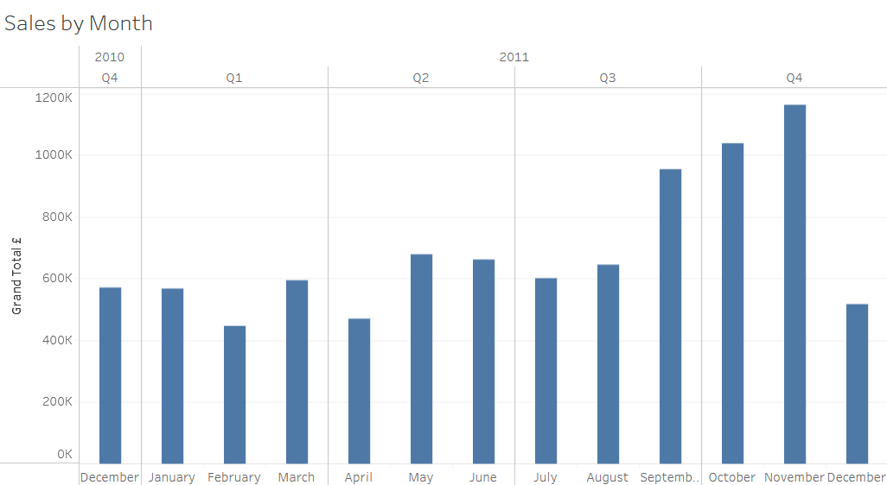
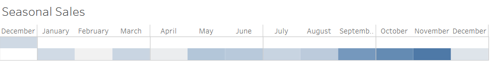

# Kaggle E-Commerce Project

## Project Overview

Analysing e-commerce transactional data to:

- Insights into sales trends based on time
- Understand customer behaviour
- Creating an interactive dashboard for stakeholders

## Data Source

This is a transnational dataset from Kaggle which contains all the transactions occurring between 01/12/2010 and 09/12/2011 for a UK-based and registered non-store online retail. The company mainly sells unique all-occasion gifts. Many customers of the company are wholesalers.

## Data Structure

| InvoiceNo | StockCode | Description                        | Quantity | InvoiceDate         | UnitPrice | CustomerID | Country        | InvoiceYear | InvoiceMonth | InvoiceDay | InvoiceTime | GrandTotal |
| --------- | --------- | ---------------------------------- | -------- | ------------------- | --------- | ---------- | -------------- | ----------- | ------------ | ---------- | ----------- | ---------- |
| 536365    | 85123A    | WHITE HANGING HEART T-LIGHT HOLDER | 6        | 2010-12-01 08:26:00 | 2.55      | 17850      | United Kingdom | 2010        | 12           | 1          | 08:26:00    | 15.30      |
| 536365    | 71053     | WHITE METAL LANTERN                | 6        | 2010-12-01 08:26:00 | 3.39      | 17850      | United Kingdom | 2010        | 12           | 1          | 08:26:00    | 20.34      |

## Insights Summary

### Sales Performance

Quarterly:

    Strong and consistent growth observed across all quarters from Q4 2010 to Q4 2011.

Monthly:

    Upward trend throughout 2011.

    A peak in sales occurred during September-November.

    Followed by a decline in December 2011.

Weekly:

    Observed peak in sales on Wednesday/Thursday (mid week) across most months

Daily:

    No discernable pattern observed within a month period.

    Increase in daily sales towards the end of the year (from August to December).

Seasonal:

    Sales are lower in the early months (Feb-Apr)

    Progressively increasing peaking around November

### Product Insights

Top Products by Sales:

    PAPER CRAFT, LITTLE BIRDIE: £168,469.60
    REGENCY CAKESTAND 3 TIER: £142,592.95
    WHITE HANGING HEART T-LIGHT HOLDER: £100,448.15

Top Products by Quantity:

    WHITE HANGING HEART T-LIGHT HOLDER: 1,971 units
    REGENCY CAKESTAND 3 TIER: 1,703 units
    JUMBO BAG RED RETROSPOT: 1,600 units

- **Co-Purchased Items:** What products are frequently purchased together (i.e., appear on the same `InvoiceNo`)?

### Customer Behavior

**Customer Behavior**

- **Customer Segmentation:** What insights does the RFM (Recency, Frequency, Monetary) segmentation reveal about distinct customer groups based on their last purchase date, total transaction count, and total spending
- **High-Value Customers:** Who are identified as the most valuable customers based on their cumulative spending?
- **Purchase Cadence:** What patterns emerge regarding the frequency of purchases by individual customers over time?
- **Geographical Performance:** Which countries are the primary drivers of sales revenue?

## Recommendations

## Dashboard

[Interactive Dashboard](https://public.tableau.com/views/KaggleEcomm/Dashboard1?:language=en-GB&:sid=&:redirect=auth&:display_count=n&:origin=viz_share_link)
